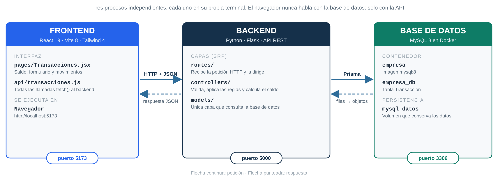

# Estación 3 · Banco de Tecnología CEIPA

**Deibis Zuluaga Baena** · Fundamentos de Software (FUNSO_2_N_H) · CEIPA Business School · Octubre de 2026

Aplicación web de tres capas para registrar los movimientos de una cuenta bancaria: consignaciones,
avances, pagos y transferencias, con el saldo calculado en todo momento. Se construyó a partir del proyecto
base entregado por el docente (`Proyecto_Completo`, un CRUD de transacciones) y lo convierte en un caso
bancario con reglas claras. El repositorio incluye también la carpeta [`PORTAFOLIO_WEB/`](PORTAFOLIO_WEB/)
con el portafolio profesional ([davis-zuluaga.onrender.com](https://davis-zuluaga.onrender.com)).



```
FRONTEND (React, :5173)  ⇄ HTTP/JSON ⇄  BACKEND (Flask, :5000)  ⇄ Prisma ⇄  MySQL (Docker, :3306)
```

Son **tres procesos independientes**, cada uno en su propia terminal. El navegador nunca habla con la base
de datos: solo con la API.

---

## Reglas del banco

| Tipo | Movimiento | Efecto en el saldo |
|---|---|---|
| `CONSIGNAR` | Entra dinero a la cuenta | Suma |
| `AVANCE` | Entra dinero desde la tarjeta de crédito | Suma |
| `PAGAR` | Sale dinero para pagar | Resta |
| `TRANSFERIR` | Sale dinero hacia otra cuenta | Resta |

- La cuenta empieza en **$0**.
- El **saldo no se guarda en la base de datos: se calcula** sumando las entradas y restando las salidas. Así
  nunca puede quedar descuadrado.
- **El saldo nunca puede quedar negativo**: no se puede pagar ni transferir más de lo disponible, y tampoco
  editar o eliminar un movimiento si eso dejaría la cuenta en negativo.
- El monto debe ser un número entero mayor que cero y el código no se puede repetir.

---

## Cambios frente al proyecto base

| Proyecto base | Esta versión |
|---|---|
| Tipos CREDITO, DEBITO, TRANSFERENCIA sin efecto sobre nada | CONSIGNAR y AVANCE suman; PAGAR y TRANSFERIR restan |
| Campo `impacto` escrito a mano | Se elimina; en su lugar se muestra el **saldo** después de cada movimiento |
| Solo rechazaba monto negativo | Valida código, tipo, monto y **saldo insuficiente** |
| Eliminar un id que no existe respondía “eliminada” | Responde `404 La transacción no existe` |
| Código repetido: error técnico | `409 Ya existe una transacción con el código …` |
| MySQL apagado: página de error HTML | `503` en JSON con un mensaje claro |
| Sin fecha | Columna `fecha` que MySQL llena sola |
| Pruebas a mano | `probar_api.py` prueba todo el CRUD automáticamente |
| Interfaz azul genérica | Banco de Tecnología CEIPA: saldo visible, entradas en verde y salidas en rojo, confirmación antes de eliminar, aviso si el servidor está apagado |

---

## Cómo ejecutarlo (macOS)

Requisitos: **Docker Desktop** (abierto), **Python 3** y **Node.js LTS**.

### Terminal 1 · Base de datos

La primera vez se crea el contenedor:

```bash
docker run --name empresa -e MYSQL_ROOT_PASSWORD=12345 -e MYSQL_DATABASE=empresa_db -p 3306:3306 -v mysql_datos:/var/lib/mysql -d mysql:8
```

Las siguientes veces solo se enciende:

```bash
docker start empresa
docker ps
```

### Terminal 2 · Backend

```bash
cd BACKEND
cp .env.example .env              # solo la primera vez
pip3 install -r requirements.txt
python3 -m prisma db push         # crea la tabla y genera el cliente de Prisma
python3 app.py                    # API en http://localhost:5000
```

### Terminal 3 · Frontend

```bash
cd FRONTEND
npm install
npm run dev                       # abrir http://localhost:5173
```

### Prueba automática del CRUD (con el backend encendido)

```bash
cd BACKEND
python3 probar_api.py             # Create, Read, Update, Delete y reglas del banco: 12/12
python3 probar_api.py --semilla   # carga 8 movimientos de ejemplo
```

### Ver los datos dentro de MySQL

```bash
docker exec empresa mysql -uroot -p12345 empresa_db -e "SELECT * FROM Transaccion;"
```

---

## API REST

| Método | Ruta | Qué hace | Respuestas |
|---|---|---|---|
| GET | `/api/salud` | Estado de la API y de MySQL | `200` · `503` |
| GET | `/api/transacciones/` | Saldo y lista de movimientos con el saldo de cada uno | `200` |
| GET | `/api/transacciones/<id>` | Un movimiento | `200` · `404` |
| POST | `/api/transacciones/` | Registra un movimiento | `201` · `400` · `409` |
| PUT | `/api/transacciones/<id>` | Edita un movimiento | `200` · `400` · `404` · `409` |
| DELETE | `/api/transacciones/<id>` | Elimina un movimiento | `200` · `400` · `404` |

Cuerpo para crear o editar:

```json
{ "codigo": "TX-0009", "tipo": "PAGAR", "monto": 250000 }
```

---

## Estructura

```
Estacion_3/
├── BACKEND/
│   ├── app.py                       Arranque de Flask, ruta /api/salud y error 503 en JSON
│   ├── db.py                        Conexión a MySQL con Prisma
│   ├── schema.prisma                Tabla Transaccion: id, codigo, tipo, monto, fecha
│   ├── routes/                      CAPA 1 · URL y método HTTP
│   ├── controllers/                 CAPA 2 · validaciones, reglas del banco y saldo
│   ├── models/                      CAPA 3 · consultas a la base de datos
│   └── probar_api.py                Prueba automática del CRUD
├── FRONTEND/src/
│   ├── pages/Transacciones.jsx      Pantalla del banco
│   └── api/transacciones.js         Llamadas al backend
├── PORTAFOLIO_WEB/                  Portafolio profesional (React + Vite + Tailwind + PWA)
├── docs/                            Diagramas
├── capturas/                        Evidencia de la ejecución
└── Estacion3_Informe_Tecnico_Deibis_Zuluaga.pdf
```

---

## Portafolio web

[`PORTAFOLIO_WEB/`](PORTAFOLIO_WEB/) contiene el portafolio profesional, publicado en
<https://davis-zuluaga.onrender.com>. Para correrlo: `cd PORTAFOLIO_WEB`, `npm install`, `npm run dev`.
